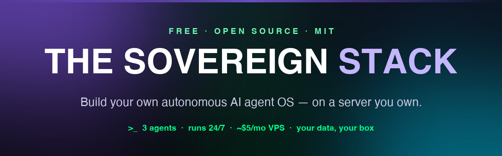

<p align="center">
  
</p>

<p align="center">
  <b>A free, open-source playbook for building an autonomous AI agent OS you actually own.</b><br>
  Persistent memory, a Telegram phone interface, and a real governance layer — running 24/7 on a ~$5/month VPS.
</p>

<p align="center">
  <a href="https://github.com/ChrisJDiMarco/sovereign-stack/blob/main/LICENSE"></a>
  
  
  <a href="https://github.com/ChrisJDiMarco/sovereign-stack"></a>
</p>

<p align="center">
  <a href="product/blueprint.md"><b>📖 Read the Guide</b></a> &nbsp;·&nbsp;
  <a href="https://chrisjdimarco.github.io/sovereign-stack/"><b>🌐 Landing Page</b></a> &nbsp;·&nbsp;
  <a href="#-quick-start"><b>⚡ Quick Start</b></a> &nbsp;·&nbsp;
  <a href="#-the-stack"><b>🧱 The Stack</b></a> &nbsp;·&nbsp;
  <a href="#-contributing"><b>🤝 Contributing</b></a>
</p>

---

## What is this?

Most "AI agent" setups forget everything the moment a session ends, cost a fortune to run around the clock, and live entirely on someone else's servers. The **Sovereign Stack** is the opposite: three AI agents that run **24/7**, **remember everything** across every session, take orders from your **phone**, and keep every byte of memory on **hardware you control**.

It's a complete, step-by-step guide — blank VPS to a running three-agent stack in a weekend. Every command, every config, every gotcha is written down. There's **no paywall, no email gate, and no price**. The software underneath is open source; this repo just saves you the ~40 hours of figuring out how the pieces fit.

> **New here?** Start with **[the guide →](product/blueprint.md)**

## Why own it instead of renting?

Managed agent products (Perplexity Computer and friends) are genuinely good. If you'd rather pay a subscription and let someone else run everything, do that — their traction proves the market is real.

This is for the other instinct: **owning it.** The memory, the data, and the cost ceiling all live on a box you control.

| What matters | Managed cloud | 🟢 Sovereign Stack |
|---|---|---|
| Where your memory lives | Their cloud | **Your server** (SQLite) |
| Where your data lives | Their servers | **Your VPS only** |
| Phone interface | Their app | **Telegram DM you control** |
| Cost model | Metered credits | **~$5/mo VPS + your capped keys** |
| Cost ceiling per agent | Plan limits | **Hard caps via Paperclip** |
| Model / provider choice | Their routing | **Claude-first, swap freely** |
| Who owns it | Your subscription | **You do — forever** |

## 🧱 The Stack

| Component | What it does |
|---|---|
| **[Hermes](https://github.com/NousResearch/hermes-agent)** | Nous Research's open-source persistent-memory agent. SQLite memory across sessions, FTS5 recall, 60+ built-in tools, a multi-channel gateway. Claude-native (+ OpenAI / OpenRouter / any OpenAI-compatible endpoint). |
| **[Paperclip](https://github.com/paperclipai/paperclip)** | Open-source "AI company OS." Visual org chart, wakeup queue with budget checks, per-agent cost caps, approval flows. Auto-provisions an embedded PostgreSQL — no DB setup. |
| **[Hetzner CX22](https://hetzner.com)** | ~$5/mo VPS (2 vCPU / 4 GB). Ubuntu 24.04, PM2 for auto-restart, Caddy for automatic HTTPS. |
| **Hermes Gateway** | Telegram listener. DM your CEO agent from anywhere, reply in ~1 second. |
| **Voice (optional)** | macOS built-in **on-device** dictation for a fully local setup — or the cloud-based [Vibing](https://github.com/VibingJustSpeakIt/Vibing) app (powered by [Microsoft VibeVoice](https://github.com/microsoft/VibeVoice)) if you want richer rewriting and accept the privacy trade-off. |

## 📦 What you'll build

The [guide](product/blueprint.md) is 13 chapters, blank server to running stack:

1. What you're building (and why you'd own it instead of renting)
2. VPS selection + bare-metal setup
3. Hermes agent — install + configuration
4. Paperclip control plane — install + first run
5. Telegram gateway — your phone interface
6. Day 1 org chart: **3 agents that work** (CEO / Research / Builder, with system prompts + budget caps)
7. Event-driven wakeups via n8n
8. Voice layer (Mac, optional)
9. Architecture diagram + an honest cost model
10. Troubleshooting
11. Backups & recovery
12. Keeping it current
13. What to build next

## ⚡ Quick Start

```bash
# 1. Read the guide (it's the whole product, free)
open product/blueprint.md

# 2. Spin up a ~$5/mo VPS (Hetzner CX22 or any 2 vCPU / 4 GB box), then follow:
#    Ch. 2  → VPS + PM2 + Caddy (auto-HTTPS)
#    Ch. 3  → Hermes (persistent SQLite memory)
#    Ch. 4  → Paperclip control plane (npx paperclipai onboard --yes)
#    Ch. 5  → Telegram gateway — DM your agent from your phone
#    Ch. 6  → your 3-agent org chart
```

**Realistic running cost: ~$69/month all-in** — a ~$5 VPS plus your own API usage, which you cap per agent in Paperclip. No platform fee; you pay providers directly.

## 🗺️ Architecture

```
  YOUR PHONE (Telegram)  ──►  Hermes Gateway  ──►  CEO Agent  ──►  reply (~1s)
                                     │
        ┌────────────────────────────┴───────────────────────────┐
        │            HETZNER CX22 VPS (~$5/mo)                     │
        │  PM2/Docker: paperclip · hermes-gateway · n8n            │
        │  Agents:    CEO (memory) · Research (web) · Builder      │
        │  Caddy → the ONLY public surface (auto-HTTPS)            │
        └──────────────────────────────────────────────────────────┘
             ▲ n8n webhooks                  ▲ your API keys (capped)
       business signals              Anthropic / OpenAI / OpenRouter
```

## 📂 This repo

```
├── index.html          Landing page (GitHub Pages)
├── product/
│   └── blueprint.md     The full implementation guide (the deliverable)
├── assets/              Header + social images
├── launch-thread.md     Launch thread for sharing
└── LICENSE              MIT
```

## 🤝 Contributing

The tools here move fast, so this is a **living guide** — each chapter notes the version it was last verified against. If a command has drifted or you found a better way:

- **[Open an issue](https://github.com/ChrisJDiMarco/sovereign-stack/issues)** describing what broke, or
- Send a **PR** with the fix — it gets folded back in for everyone.

No contribution is too small; a single corrected install command helps the next person.

## 📜 License

MIT © [Chris DiMarco](https://github.com/ChrisJDiMarco). Use it, fork it, build your stack.

---

<p align="center">
  <b>⭐ If this helped you stand up your own stack, star the repo — it's the whole thank-you.</b><br>
  <sub>Built and maintained by <a href="https://github.com/ChrisJDiMarco">Chris DiMarco</a>.</sub>
</p>
